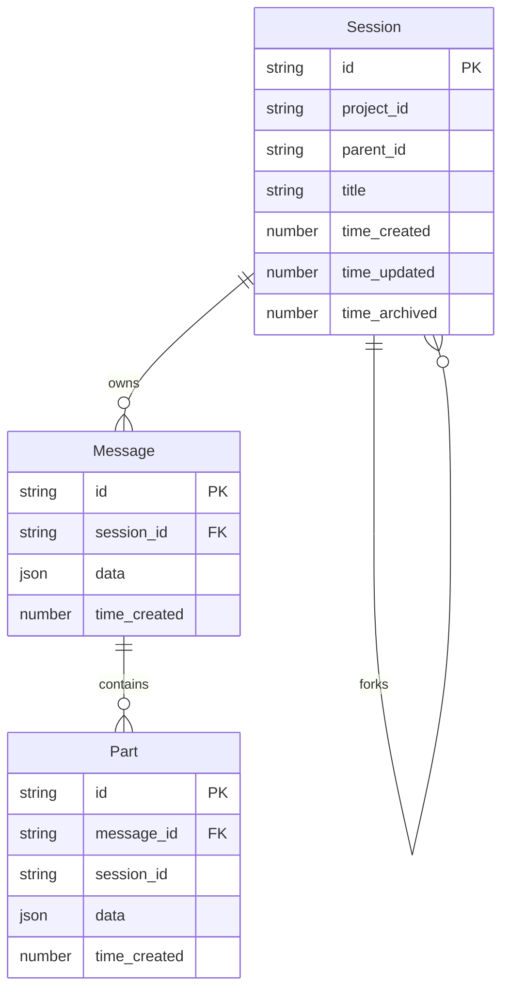

---
title: 会话系统（最新版）从入门到实现
description: 用通俗方式理解 OpenCode 会话系统：核心实体、关系图、关键流程伪代码与设计取舍。
---

这篇文章基于最新代码梳理 OpenCode 的会话系统实现，目标是：先看懂概念，再看懂结构，最后看懂流程和设计取舍。

---

## 先用一句话理解会话系统

把 `Session` 想成一次完整对话的"容器"：

- `Session` 负责会话级元数据（标题、归档、分享、权限、回滚状态）。
- `Message` 负责每一轮用户/助手消息元信息。
- `Part` 负责消息里的细粒度内容（文本、工具调用、推理、文件等）。

当对话变长时，会触发压缩与修剪；当你想分支探索时，会 fork 子会话；当你删除会话时，数据会级联清理。

---

## 先纠正一个关键认知：存储架构已升级

旧版本文章里常见的说法是"主要基于 JSON 文件存储会话与消息"。  
在最新版中，主干数据已经迁移到 **SQLite + Drizzle**：

- `session` 表：会话元数据
- `message` 表：消息元数据
- `part` 表：消息部分

并且通过外键 `onDelete: "cascade"` 自动级联删除。  
目前仍有少量数据（例如 `session_diff`）走 `Storage` 读写。

---

## 核心实体与数据结构

### 1) Session.Info（会话元数据）

可以把它看成"会话总索引"：

```ts
{
  id: string
  slug: string
  projectID: string
  directory: string
  parentID?: string
  title: string
  version: string
  summary?: {
    additions: number
    deletions: number
    files: number
    diffs?: Snapshot.FileDiff[]
  }
  share?: { url: string }
  permission?: PermissionRuleset
  revert?: {
    messageID: string
    partID?: string
    snapshot?: string
    diff?: string
  }
  time: {
    created: number
    updated: number
    compacting?: number
    archived?: number
  }
}
```

其中最常用的几个字段：

- `parentID`：标识它是否是 fork 出来的子会话
- `summary`：会话级变更统计（用于展示/回滚辅助）
- `revert`：回滚状态锚点
- `time.*`：会话生命周期时间线

### 2) Message（消息元信息）

`Message` 只存消息"壳"，内容主体在 `Part`：

- 用户消息：模型选择、Agent、创建时间等
- 助手消息：token、cost、finish/error、parentID、summary 标记等

### 3) Part（消息细粒度内容）

一条消息可包含多个 `Part`，常见类型：

- `text`
- `reasoning`
- `tool`
- `file`
- `compaction`
- `step-start` / `step-finish`

尤其是 `tool` part，带状态机：

- `pending -> running -> completed`
- 或 `pending -> running -> error`

---

## 实体关系图（Mermaid）



---

## 关键流程伪代码（由简入繁）

### 流程 A：创建会话

```pseudo
function createSession(input):
  info.id = generateDescendingSessionID()
  info.slug = randomSlug()
  info.title = input.title or defaultTitleByParent(input.parentID)
  info.time.created = now()
  info.time.updated = now()

  insert SessionTable(info)
  publish session.created(info)

  if isParentSession(info) and autoShareEnabled():
    try share(info.id) catch ignore

  publish session.updated(info)
  return info
```

关键点：

- 默认标题会区分父会话与子会话前缀
- 创建后会发两类事件：`created` 与 `updated`
- 自动分享只对父会话触发

### 流程 B：fork 子会话（消息克隆 + ID 映射）

```pseudo
function forkSession(sourceSessionID, stopAtMessageID?):
  source = getSession(sourceSessionID)
  child = createSession(title = nextForkTitle(source.title))
  idMap = newMap()

  for msg in listMessagesInOrder(sourceSessionID):
    if stopAtMessageID exists and msg.id >= stopAtMessageID:
      break

    newMessageID = generateAscendingMessageID()
    idMap[msg.id] = newMessageID

    parentID = remapAssistantParentIfNeeded(msg.parentID, idMap)
    clonedMsg = upsertMessage(msg with id=newMessageID, sessionID=child.id, parentID=parentID)

    for part in msg.parts:
      upsertPart(part with newPartID(), messageID=clonedMsg.id, sessionID=child.id)

  return child
```

关键点：

- 不是"复制文件夹"，而是按消息链语义克隆
- 助手消息 `parentID` 会重映射，保持对话谱系正确

### 流程 C：流式读取消息（分页 + 批量 parts）

```pseudo
function streamMessages(sessionID):
  size = 50
  offset = 0

  loop:
    rows = query Message where session_id=sessionID
           order by time_created desc
           limit size offset offset
    if rows empty: break

    ids = rows.map(id)
    partRows = query Part where message_id in ids
               order by message_id, id
    partsByMessage = groupBy(partRows, message_id)

    for row in rows:
      yield { info: row.data + row.id, parts: partsByMessage[row.id] or [] }

    offset += rows.length
    if rows.length < size: break
```

关键点：

- 避免 N+1：先批量拉一页 Message，再一次拉这页所有 Part
- 保持流式输出，兼顾长会话性能

### 流程 D：溢出判断 + prune 修剪

```pseudo
function isOverflow(tokens, model, config):
  if config.compaction.auto is false: return false
  if model.context == 0: return false

  used = tokens.total or (tokens.input + tokens.output + tokens.cache.read + tokens.cache.write)
  reserved = config.compaction.reserved or min(20000, model.maxOutput)
  usable = model.limit.input ? (model.limit.input - reserved)
                           : (model.context - model.maxOutput)
  return used >= usable
```

```pseudo
function prune(sessionID):
  msgs = listMessages(sessionID)
  walk from newest to oldest
  keep last two user turns untouched
  stop when reach summary boundary
  skip protected tools (e.g. skill)

  collect old completed tool outputs beyond protectWindow
  if estimatedReclaim > minimum:
    mark part.state.time.compacted = now()
    upsertPart(part)
```

关键点：

- 不是直接删历史，而是给可修剪工具输出打 `compacted` 标记
- 压缩与修剪目标是"降低上下文成本"，不是"破坏可追溯性"

### 流程 E：删除会话（递归 + CASCADE）

```pseudo
function removeSession(sessionID):
  session = getSession(sessionID)

  for child in listChildren(sessionID):
    removeSession(child.id)

  try unshare(sessionID) catch ignore

  delete from SessionTable where id=sessionID
  // Message / Part by FK cascade

  publish session.deleted(session)
```

关键点：

- 先递归删子会话，再删当前会话
- 依赖数据库外键级联，避免手写多层删除循环

---

## 事件模型：为什么 UI 能实时更新

会话层关键事件：

- `session.created`
- `session.updated`
- `session.deleted`
- `session.diff`
- `session.error`
- `session.compacted`（压缩完成后发布）

消息层关键事件：

- `message.updated`
- `message.removed`
- `message.part.updated`
- `message.part.removed`
- `message.part.delta`

事件总线把"数据库状态变化"转成"界面/插件可订阅信号"，这是会话系统可扩展的关键。

---

## 设计取舍：为什么这么做

### 1) 一致性：DB 事务 + 事件延迟执行

`Database.effect` 让副作用在数据库上下文完成后再执行，降低"写入成功但事件乱序"的风险。

### 2) 性能：消息与部分拆表

- 读取会话列表时不用加载全部 Part
- 增量更新时只改对应 Part，不必重写整条消息

### 3) 可扩展：Part 类型可持续扩展

随着 Agent 能力增长（子任务、多模态、补丁、快照），只需新增 Part 类型，不必重构会话骨架。

### 4) 兼容演进：混合存储过渡

主干走 SQLite，局部仍保留 `Storage`（如 `session_diff`），让迁移更平滑，避免一次性大爆炸重构。

---

## 给开发者的实践建议

1. **先看三表再看业务**：先理解 `SessionTable/MessageTable/PartTable`，再读 `Session` API，会快很多。
2. **排查问题先看事件**：如果 UI 异常，优先确认事件是否发布，而不仅是 DB 是否写入。
3. **关注消息顺序语义**：fork、回滚、压缩都依赖消息顺序和 parent 关系，顺序错了后果很隐蔽。
4. **压缩阈值按模型调**：大上下文模型可适当放宽 `reserved`；小上下文模型建议更激进。
5. **删除逻辑相信 CASCADE**：别重复造手工删除链，优先使用外键约束保障一致性。

---

## 小结

如果只记住一句话：**最新版 OpenCode 会话系统，本质是"Session 统筹 + Message 编排 + Part 细粒度表达 + 事件驱动 + 压缩治理"的组合架构。**

它既能支撑日常短对话，也能在长链路、工具密集、分支探索场景下保持可维护性和性能。
